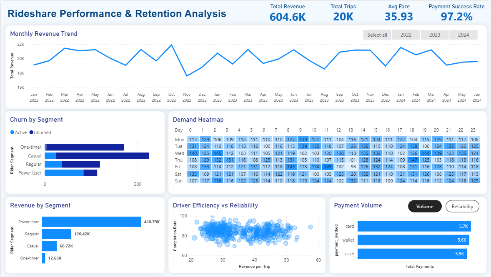

# 🚕 Rideshare Data Analysis (SQL + Power BI)

## 📌 Overview

This project analyzes a rideshare platform dataset to uncover key drivers of revenue, demand patterns, driver performance, rider retention, and payment reliability.

The objective is to transform raw data into actionable insights that can support business decisions around growth, efficiency, and user retention.

---

## ❓ Business Questions

1. How is monthly revenue trending, and how volatile is it?
2. When is demand highest — by hour and day of week?
3. Who are the top-performing drivers, and who is underperforming?
4. Who are our most valuable riders, and are we retaining them?
5. Are payments completing successfully, and which methods dominate?

---

## 📊 Dashboard Preview



## 📊 Dashboard Breakdown

- **Top KPIs** → Overall business health (revenue, trips, success rate)
- **Revenue Trend** → Identifies growth stagnation and volatility
- **Demand Heatmap** → Highlights commuter-driven usage patterns
- **Driver Scatter Plot** → Shows trade-off between efficiency and reliability
- **Rider Segmentation** → Reveals high churn and revenue concentration
- **Payment Analysis** → Confirms system reliability across methods
---

## 🔍 Key Insights

- Revenue is stable but shows no strong long-term growth trend
- Demand is highly concentrated during weekday commute hours
- Driver efficiency and reliability show a weak correlation
- A small group of power users drives the majority of revenue
- Early-stage rider churn is significantly high (especially one-time users)
- Payments are highly reliable (~99% success rate) across all methods

---

## 📈 Business Impact

- Growth requires improving rider retention, not just acquisition
- Peak demand periods should be optimized for pricing and supply
- Driver performance should focus on reliability, not just volume
- Revenue dependency on power users introduces business risk

---

## 🧠 Approach

- SQL used for data extraction and analytical queries
- Power BI used for data modeling, visualization, and dashboard design
- Implemented time-based analysis (MoM trends, demand patterns)
- Built segmentation logic for drivers and riders
- Designed interactive dashboard with slicers and bookmarks

---

## 🛠️ Tools & Techniques

- SQL (CTEs, window functions, aggregations)
- Power BI (DAX, data modeling, visuals, bookmarks)
- Data Analysis & Business Insight Generation

---

## 📁 Project Structure

```
rideshare-analytics/
│
├── data/
├── sql/
├── powerbi/
├── images/
│
└── README.md
```

---

## 🚀 How to Use

1. Run SQL files to explore and analyze the dataset
2. Open the Power BI file to interact with the dashboard
3. Use slicers to filter data and explore trends

---

## 📦 Data Source

The dataset used in this project is sourced from a publicly available [rideshare dataset](https://www.kaggle.com/datasets/rockyt07/uber-sql-database) on Kaggle (originally based on an Uber-like platform).

It has been used for educational and analytical purposes.

---

## 📈 Key Takeaway

Good analysis is not about building more charts —  
it’s about making the right insights obvious and actionable.
